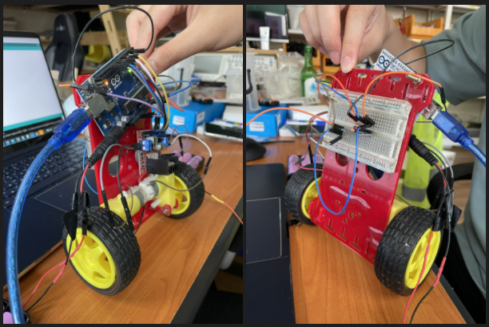
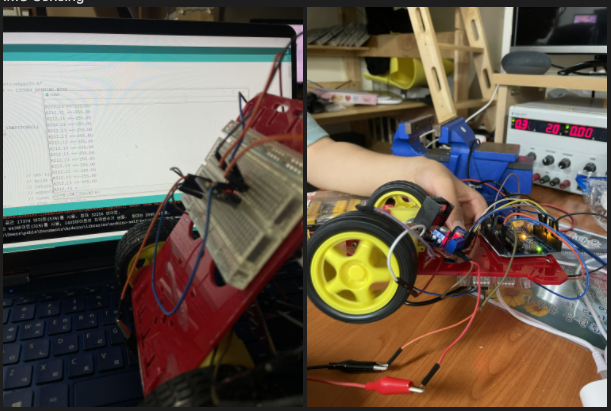

# Balancing robot
 Balancing robot with PID control system

## Specification
- Processor: Arduino uno     
- IMU sensor: MPU6050     
- Motor: DG02S
- Motor driver: L298N     

## PID Control
- controlling output u(t) defined as:

ref: https://en.wikipedia.org/wiki/PID_controller     
ref: https://setoo0922.tistory.com/259

## Demo
- Frames    
 

- Test on modules

- Overall    

    

## Contributors
박성호 이주용